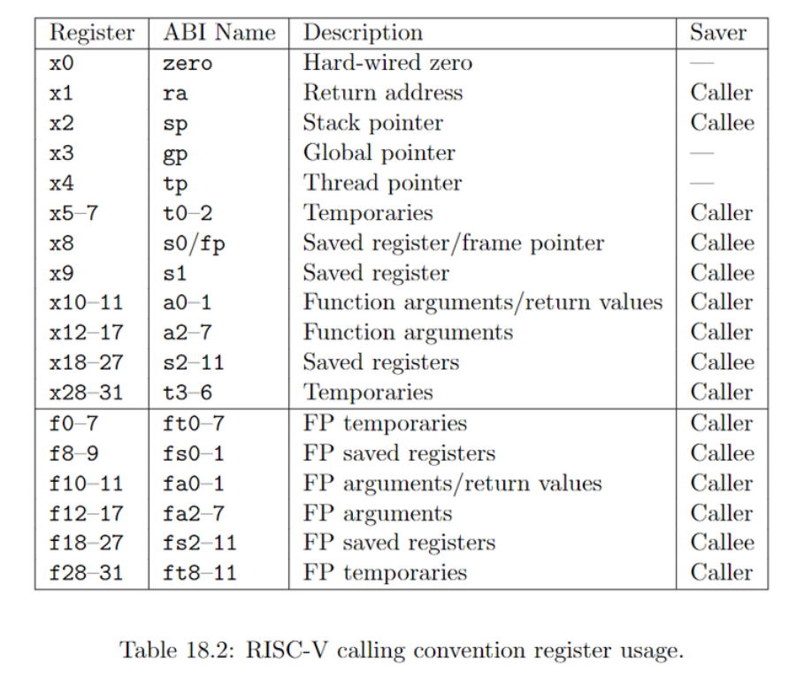

# SJTU CS2612 程序语言与编译原理课程大作业：寄存器分配

## 项目简介
本次项目作业利用课上所讲授的liveness分析方法,在一段程序已经做好基本快生成的情况下，进行寄存器分配，具体实现的功能有：  
* liveness分析
* 寄存器分配
* 汇编代码生成
* 在考虑系统调用的函数情况下对caller与callee saved寄存器进行了处理

## 项目环境
该项目基于WhileDC语言进行寄存器分配的编写，支持的语言指令有：
* 基本算术运算：```ADD```, ```MINUS```, ```MUL```, ```DIV```, ```MOD```
* 基本逻辑运算：```AND```, ```OR```, ```NOT```
* 基本指针运算：```DEREF```
* 基本运行语句：顺序执行语句，赋值语句，IF分支条件，WHILE语句，SKIP
* 基本控制流：```continue```, ```break```
* 基本系统调用：```read_int()```, ```write_int()```
* （备注：这些语句是理论上可以的实现的，例如控制流语句```break```以及```continue```需要在基本块生成当中去实现。由于我们的项目是基于基本快生成来完成寄存器分配，因此如果基本块无法实现这些功能则上述语句无法实现。）

## 如何使用
* 主程序为```backend_complier.cpp```，待分配程序以```output.txt```文档的形式给出，直接编译运行```backend_complier.cpp```即可对```output.txt```内的程序进行寄存器分配
* ```rg_cnt```维护了本次中寄存器可供分配的最大数量，修改```rg_cnt```的值可以改变寄存器分配的数量。（在实际使用时，考虑到实际的体系结构，我们允许的最大可使用寄存器数目是18.）

## 各部分具体功能简介
1. liveness分析：
   * 对每一条指令提取use与def集合
   * 根据整体程序之间的联系计算每一条指令中liveness的变量
2. 寄存器分配：
   * 完成基本操作：simplify，coalesce，freeze，spill
   * 遇到真spill情况对程序进行改写，引入将数据存取于内存的指令
3. 汇编代码生成：
   * 选取RISC-V作为汇编输出
   * 实现每一条指令的汇编生成
4. 函数调用中caller与callee saved寄存器考虑
   * 本项目中所有函数调用只考虑svc系统调用，因为在一个基本块中，倘若出现其余函数跳转，其理应作为一个新的基本块生成，而非以函数的形式出现在基本块中。本项目中我们假设能够被自由分配的寄存器仅有```x5-x7, x9, x18-x31```共18个寄存器，```x0```是0寄存器无法使用，```x1```寄存器是返回值寄存器，也最好不要使用。而针对过程调用的参数传递，我们留出了```x10-x17```这8个参数寄存器以及```x2```栈指针寄存器用于传递参数，不去使用它们。但是考虑到程序的正确运行，虽然我们分配寄存器不允许使用这些寄存器，但是过程调用的时候应当对它们进行保存和恢复。由于我们的程序无法判断自己需要使用几个参数，因此我们总是假定需要用到全部参数（8个），同时也假定所有的过程调用都有返回值，因此需要把```x1, x10-x17```全部备份以及恢复。同时，如果需要的参数量多于8个或者返回值多于8，那么我们还需要用到栈寄存器（```x2```）来保存额外的参数。这个过程非常繁琐，本项目中并未考虑到这种情况，即我们假定所有的过程调用参数都不多于8.
   * 我们将待分配寄存器的整个程序看作一个被调用函数，即在整个```output.txt```中，只有程序本身作为callee，需要考虑callee_saved寄存器问题，其余情况下的函数调用，我们以caller视角，仅考虑caller_saved寄存器问题。我们直接在汇编语句的层面上对此前得到的结果进行调整来完成过程调用的实现。
   * 我们最初的想法是简单的在汇编层面将所需备份的写入内存中，但曹钦翔老师认为这样对内存的占用较大，性能并不理想。曹钦翔老师对于此部分的建议是：引入临时变量对寄存器值进行保存，并对临时变量进行liveness分析，并且直接使用寄存器分配来完成。但这样的方式引入了额外的困难：原本的程序是不涉及寄存器的，仅有变量与变量之间的操作；按照老师的建议则会引入变量与寄存器之间的赋值，这会直接导致我们的算法无法正常工作；与此同时，我们原有的寄存器分配算法的正确性也将无法得到保证。对此，我们进行了分析，并得出可以直接在汇编层面上对代码进行调整就可以实现等价的操作。
   * 针对caller-saved寄存器的分配，我们采用的策略是：首先在不考虑过程调用的情况下完成上述寄存器分配算法。随后，对于涉及过程调用的指令，我们根据该指令的liveness情况分析出此时此刻寄存器的使用情况。只有既是caller-saved又在此时被占用的寄存器需要备份，在此时空闲的callee-saved寄存器中选取对应数目的寄存器完成备份即可；如果寄存器数目不足则写入内存。在完成过程调用后再从这些地方对备份的寄存器进行恢复。
   * 而针对callee-saved寄存器的分配，则是再caller-saved寄存器的基础上完成的。在程序的一开始我们应当对所有的callee-saved寄存器进行备份（无法得知调用者的使用情况），在程序结束后对其进行恢复。额外统计一个全局寄存器使用情况，对callee-saved寄存器只能选择全程没有被使用过的寄存器。如果寄存器不足则使用内存进行备份。
   * 关于这样的操作和老师提出的方式等价：这是因为所有的临时变量的live区域仅仅在对应的过程调用处，并且彼此两两不相干。因此我们只需要避开过程调用处live的变量对应的寄存器，剩下的寄存器是可以随意使用的。因此我们无需把这些变量添加到原有的程序中统一进行寄存器分配，而是在不考虑过程调用的前提下完成寄存器分配后再根据已有的分配情况特殊处理即可。这个过程本身和寄存器分配算法原则一致，因此我们认为和曹老师的思路是本质一致的，结果也应当是等价的。


   * 本次项目的寄存器规划如下图所示：
     


